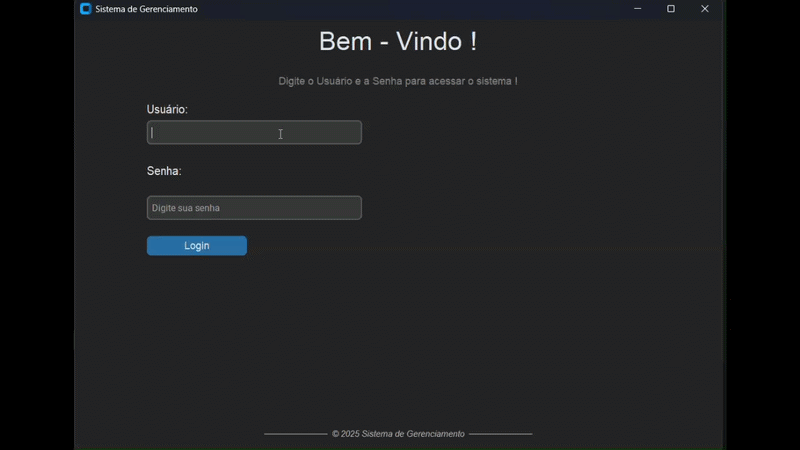
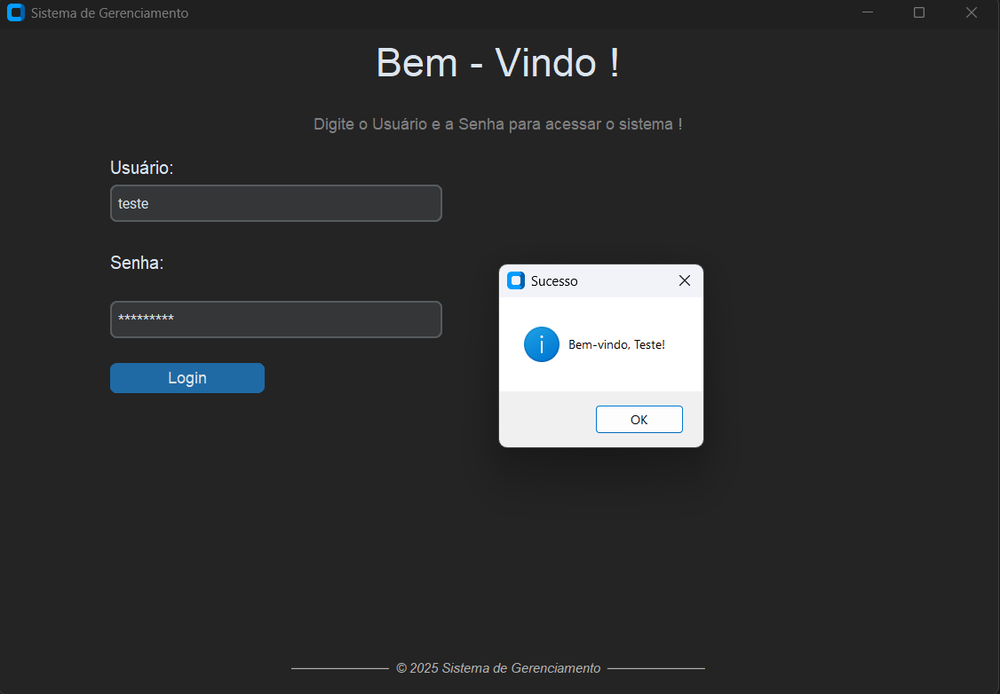
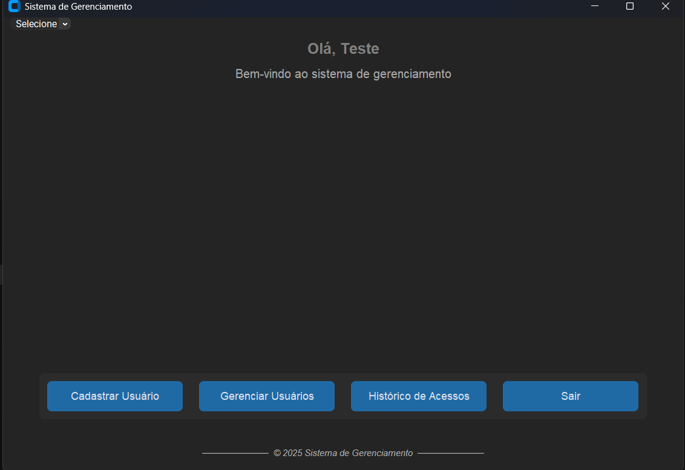
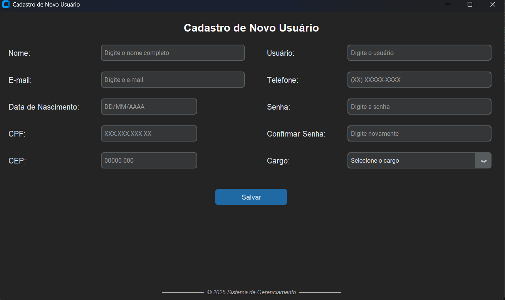
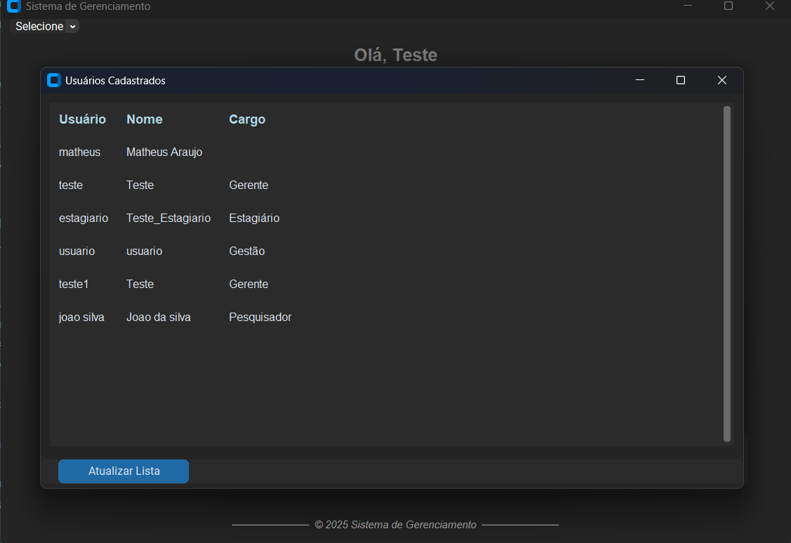
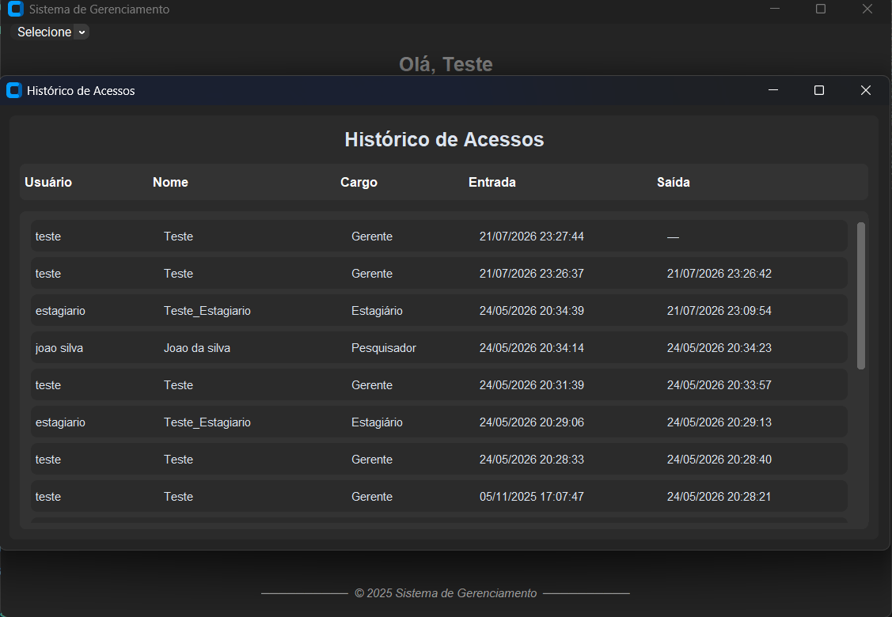

# Projeto-Sistema-Gerenciamento

Sistema de gerenciamento de usuários desenvolvido em **Python** com interface gráfica utilizando **CustomTkinter**.

O projeto simula um sistema de controle de acesso, permitindo o cadastro de usuários, autenticação por login e gerenciamento de registros de entrada e saída, com diferentes níveis de permissão conforme o cargo do usuário.

## Demonstração

## Tecnologias utilizadas

* Python
* CustomTkinter
* JSON
* Hashlib
* Base64
* Criptografia utilizando funções Hash

## Funcionalidades

* Cadastro de usuários
* Sistema de login
* Controle de permissões por cargo
* Registro de entrada e saída de usuários
* Armazenamento de dados em arquivos JSON
* Proteção das senhas por meio de criptografia Hash

## Controle de acesso

O sistema possui diferentes níveis de acesso de acordo com o cargo do usuário.

* **Gerente:** possui acesso completo aos usuários cadastrados e aos registros de entrada e saída.
* **Estagiário:** possui acesso apenas ao próprio cadastro e ao seu histórico de registros.

## Objetivo

Este projeto foi desenvolvido com o objetivo de praticar conceitos como:

* Interface gráfica com CustomTkinter;
* Autenticação de usuários;
* Controle de permissões (RBAC);
* Manipulação de arquivos JSON;
* Organização de projetos em Python;
* Criptografia de senhas utilizando Hash.

Além disso, o sistema busca simular um cenário real de controle de acesso e gerenciamento de usuários, servindo como projeto de estudo e portfólio.

## Demonstração

### Tela de Login

### Menu Principal

### Cadastro

### Lista

### Histórico

